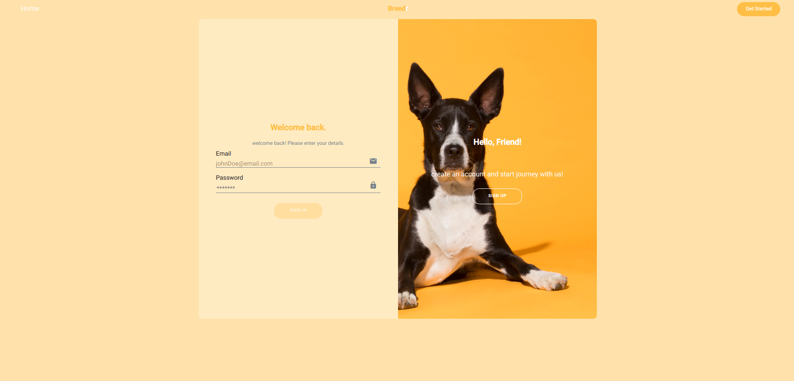

<h1 style="color:#FEBB59">Breedr</h1>
  

    The first ever website for animal breeding!
     
  

  
Table of Contents

  <ol>
    <li>
      <a href="#about-the-project">About The Project</a>
      <ul>
        <li><a href="#built-with">Built With</a></li>
      </ul>
    </li>
    <li>
      <a href="#getting-started">Getting Started</a>
      <ul>
        <li><a href="#prerequisites">Prerequisites</a></li>
        <li><a href="#installation">Installation</a></li>
      </ul>
    </li>
    <li><a href="#usage">Usage</a></li>
  </ol>

<!-- ABOUT THE PROJECT -->
## About The Project 

Breedr allows its users to add their animals and control who they breed with as they wish.
### Built With
frameworks used in this project
* [![Angular][Angular.io]][https://angular.io/]
* [![Bootstrap][Bootstrap.com]][https://getbootstrap.com]
